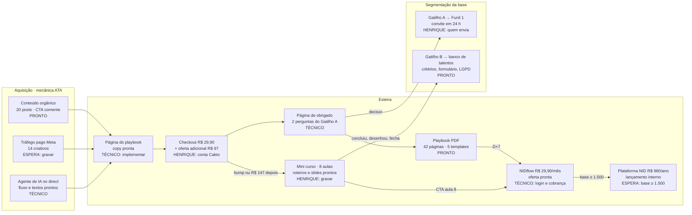

# Mapa de execução do Funil 2 · NID

Versão em texto de `docs/mapa-de-execucao.html` (mesmo conteúdo, em Markdown com fluxograma Mermaid). Atualizado em 15/09/2026, após os seis sprints e a revisão de coerência (`docs/02-revisao-de-coerencia.md`).

Legenda: **PRONTO** (conteúdo entregue e revisado) · **HENRIQUE** (só ele pode fazer) · **TÉCNICO** (implementação pelo time ou desenvolvedor) · **ESPERA** (depende de condição externa).

## 1. A esteira e onde cada parte está

O conteúdo de todas as caixas está pronto. O que separa o funil da primeira venda são ações do Henrique e implantação técnica.

## 2. Estado por sprint

| Sprint | Entregável | Onde | Estado |
|---|---|---|---|
| 1 · Fundação | Brief-mestre (13 seções, v1.0) | `docs/00-brief-mestre.md` | HENRIQUE: aprovar com os ajustes do parecer |
| 1 | Parecer estratégico (pesquisa, economia do funil, vereditos) | `docs/01-parecer-estrategico.md` | PRONTO |
| 1 | Revisão de coerência (47 peças, 146 vereditos) | `docs/02-revisao-de-coerencia.md` | PRONTO |
| 2 · Playbook | Texto integral (13.881 palavras, 11 capítulos) | `produtos/playbook/01-playbook.md` | HENRIQUE: aprovar (caso conduzido) |
| 2 | PDF diagramado A4, 42 páginas | `produtos/playbook/03-playbook.pdf` | PRONTO |
| 2 | 5 templates de fluxo (MD, HTML, PDF) com CTA do NIDflow | `produtos/playbook/templates/` | PRONTO |
| 2 | Página de vendas, checkout e oferta adicional, obrigado, upsell condicional | `produtos/playbook/pagina-*.md`, `checkout-e-order-bump.md` | TÉCNICO: implementar (spec `nid-pages` incluída) |
| 3 · Mini curso | Grade e 8 roteiros palavra por palavra (~108 min) | `produtos/mini-curso/00-grade.md`, `aulas/` | HENRIQUE: gravar |
| 3 | 73 slides em 8 PDFs 16:9 | `produtos/mini-curso/slides/` | PRONTO |
| 3 | 5 materiais do aluno (inclui modelo de proposta em PDF) | `produtos/mini-curso/materiais/` | PRONTO |
| 3 | Guia de gravação e página de vendas R$ 147 | `produtos/mini-curso/` | PRONTO |
| 4 · Automações | 5 fluxos (agente, entrega, D+7, gatilhos, integrações) | `automacoes/01` a `05` | PRONTO |
| 4 | 9 sequências de e-mail e WhatsApp (texto final) | `automacoes/sequencias/` | PRONTO |
| 4 | NIDflow: plano, onboarding, oferta D+7, mensagens | `produtos/nidflow/` | PRONTO |
| 4 | NIDflow: auditoria do HTML, login e cobrança (B-00 a B-09) | `produtos/nidflow/04-backlog-tecnico.md` | TÉCNICO: 16 a 22 dias |
| 4 | Orquestrador, webhooks, WhatsApp API, agente no direct | `automacoes/05-integracoes.md` | TÉCNICO |
| 5 · Tráfego | 8 ângulos, 14 criativos, calendário de 4 semanas | `campanhas/01` a `03` | PRONTO |
| 5 | Plano de verba (R$ 9.000 em 30 dias, tetos R$ 40 / R$ 32) e métricas | `campanhas/04`, `05` | HENRIQUE: aprovar |
| 5 | Gravação da rodada 1 de criativos | `campanhas/02-criativos.md` | HENRIQUE: uma manhã |
| 5 | Início da mídia paga | | ESPERA: mini curso gravado e checkout no ar |
| 6 · Plataforma | Estrutura, catálogo (7 inclusos, 4 avançados), comunidade, lançamento, retenção | `produtos/plataforma/01` a `05` | PRONTO |
| 6 | Página (3 modos), 19 mensagens de lançamento, régua de renovação, textos do ambiente | `produtos/plataforma/pagina-de-vendas.md`, `automacoes/sequencias/08`, `09` | PRONTO |
| 6 | Gravação de I-01, I-02, I-03 e A-01 (21 aulas) | | HENRIQUE: depois, 8,5 dias |
| 6 | Primeira abertura | | ESPERA: base ≥ 1.500 compradores |

## 3. Ações do Henrique, em ordem

Só o que ninguém mais pode fazer (fonte: revisão de coerência, seção 7).

**Fase 1 · até a primeira venda orgânica (cerca de 7 horas)**

| # | Ação | Tempo |
|---|---|---|
| 1 | Ler e aprovar o brief com as mudanças do parecer e as seis decisões da seção 12 (na mesma leitura: upsell de um clique, whitelisting, nome da reunião, segmentos citáveis) | 2 h |
| 2 | Entregar o HTML do NIDflow e decidir quem executa o backlog | 30 min |
| 3 | Decidir o checkout (Cakto, Kiwify reserva) e abrir a conta; emissor de nota fiscal e regime tributário com o contador; subdomínio; e-mails de suporte e privacidade | 2 h + contador |
| 4 | Dar os acessos da Meta (Business Manager, conta F2, verificação, WhatsApp Cloud API, Instagram profissional) | 1 h |
| 5 | Definir quem envia o convite do Gatilho A em seu nome, quem modera e avalia projetos, limiares do Gatilho B | 30 min |
| 6 | Validar as afirmações sobre a prática da NID usadas em anúncio | 30 min |
| 7 | Aprovar os termos de uso e a política de privacidade | 30 min |

**Fase 2 · até a mídia paga (mais 12 horas, condicionadas ao NIDflow pronto)**

| # | Ação | Tempo |
|---|---|---|
| 8 | Gravar o mini curso (três sessões; aula 4 só após B-02, B-04 e B-06) | 6h30 + 1 h |
| 9 | Gravar a rodada 1 dos criativos | uma manhã |
| 10 | Aprovar a verba de teste, os tetos de CPA e a regra econômica | 15 min |
| 11 | Ler o relatório de 30 dias da mídia e decidir | 1 h em T+30 |

**Fase 3 · Plataforma NID (base ≥ 1.500)**

| # | Ação | Tempo |
|---|---|---|
| 12 | Decidir os itens da Plataforma; gravar I-01, I-02, I-03, A-01 e os dois vídeos; conduzir os encontros | 8,5 dias, depois ~6 h/mês |

## 4. Frentes de execução técnica

| Frente | O que é | Fonte | Estimativa | Bloqueia |
|---|---|---|---|---|
| Páginas | Página do playbook, checkout com oferta adicional, obrigado com Gatilho A, página do mini curso, oferta do NIDflow | `produtos/*/pagina-*.md` | 5 a 8 dias | Primeira venda |
| NIDflow como produto | Auditoria, login, cobrança por webhook, templates dentro da ferramenta, PDF, telemetria | `produtos/nidflow/04-backlog-tecnico.md` | 16 a 22 dias | Oferta em D+7 (fica em fila) |
| Orquestrador e integrações | Webhooks Cakto, base F2, Resend, WhatsApp Cloud API, tarefas do Gatilho A, pixel e API de Conversões | `automacoes/05-integracoes.md` | 8 a 12 dias | Entrega automática e Gatilho A |
| Agente de IA | Prompt, base de conhecimento, comentário → direct → checkout; revisão do app na Meta (2 a 6 semanas) | `automacoes/01`, `sequencias/06` | 5 a 8 dias + Meta | CTA "comente" (até lá, link direto) |

Caminho mínimo para a primeira venda: ações 1 a 7 do Henrique + frente "Páginas" + webhooks básicos da Cakto (entrega por e-mail). O mini curso gravado é pré-requisito só da mídia paga e da oferta adicional; o orgânico pode começar antes com o playbook sozinho.

## 5. O que bloqueia o quê

| Bloqueia | Pendências (números da revisão, seção 6) | Quem resolve |
|---|---|---|
| Primeira venda | Brief (P-01) · checkout validado e conta (P-03, P-07) · domínio e URLs (P-04) · dono do Gatilho A (P-10) · nota fiscal (P-11) · termos e privacidade (P-19) · infraestrutura (P-20) | Henrique decide e libera; time executa |
| Mídia paga | NIDflow pronto (P-02) · mini curso gravado (P-06) · verba e tetos (P-13) · afirmações validadas (P-18) | Henrique grava e aprova; desenvolvedor executa |
| CTA "comente" | Revisão do app na Meta, 2 a 6 semanas (P-08) | Henrique dá acessos; automação pede a revisão |
| Plataforma | Decisões (P-15) · roteiros e gravações de abertura, área de membros, etiquetas (P-16) · base ≥ 1.500 | Henrique; roteiro, copy, automação, plataforma |
| Nada | Nome da reunião (P-05) · limiares do Gatilho B (P-09) · segmentos (P-12) · whitelisting (P-14) · dados reais (P-17) · plano B do bump (P-21) · período grátis do NIDflow (P-22) | Henrique, quando houver dado |
